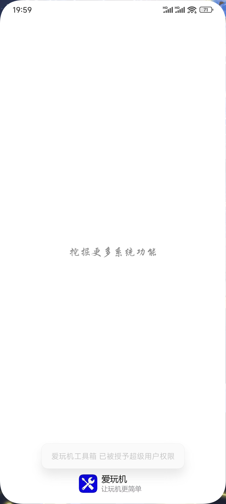
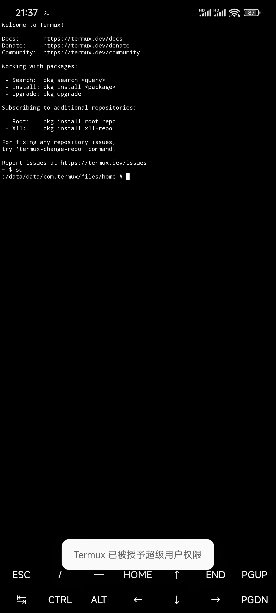

# KernelSU Next Toast

Show a root grant toast notification like Magisk on KernelSU Next and forks (KSUN, SukiSU, ReSukiSU).

Forked from https://github.com/NativeStar/KernelSUGrantToast
Original author: NativeStar
Fork by: itstheCLAW & Claude (Anthropic)

## Screenshots

## Features
- Toast notification when an app is granted root
- Package exclusion list via WebUI
- Compatible with KSUN, SukiSU, ReSukiSU and forks
- SuLog remains fully readable (unlike the original module)
- Midnight log rollover handled automatically

## Requirements
- KernelSU Next, SukiSU, or ReSukiSU
- SuLog must be enabled in your KSU manager
- Does not require Zygisk or Meta Module

## Installation
1. Download the module zip from Releases
2. Open your KSU manager and flash the zip
3. Ensure SuLog is enabled before rebooting
4. Reboot

## Configuration
Open the module WebUI in your KSU manager to add apps to the exclusion list (takes effect immediately, no reboot needed) or change language and theme.

## How It Works
The original module worked by stealing the kernel sulog file descriptor from ksud, which broke SuLog readability and did not work on KSUN forks.

This fork takes a different approach. A shell script (sulog_mirror.sh) tails the SuLog file directly. When a root grant is detected it resolves the package name and writes it to /data/adb/su-toast/lastsu.txt. The native daemon watches that file via inotify and displays the toast. SuLog remains fully readable and ksud is never killed.

For ReSukiSU compatibility, since all sucompat entries show uid=0, the script uses ppid-based process lookup to identify the requesting app.

## Changelog

### v3.1 (current)
- Add ppid-based lookup for ReSukiSU (DefaultDispatch, BROWSE_THREAD_1, pool-*, bash thread names)
- Fix addon process resolution (MixPlorer addons now correctly show as MixPlorer)
- Fix /data/data/ path resolution for Termux and similar apps

### v3.0
- Complete rewrite of detection mechanism - file tail instead of kernel ioctl
- KSUN/SukiSU/ReSukiSU compatibility
- SuLog no longer broken after module install
- Midnight log rollover via clock watcher
- Package exclusion via WebUI (takes effect immediately, no reboot needed)
- Moved data directory to /data/adb/su-toast/
- Updated WebUI - removed unsupported options, added proper credits
- Updated LICENSE with fork copyright notice

## License
MIT License - see LICENSE file

Original work Copyright (c) 2024 NativeStar
Modifications Copyright (c) 2026 itstheCLAW & Claude (Anthropic)
